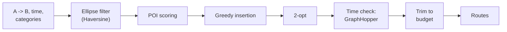

# Walk of Interest - Backend

[Русский](README.md) | **English**

REST API for the [Walk of Interest](https://github.com/artemalo/WalkOfInterest) mobile app: generating walking routes through points of interest (POI) based on interest categories, time budget, and ratings.


## Highlights

- **Route generation algorithm** - custom-built: ellipse candidate filter, weighted POI scoring, greedy insertion + 2-opt, time verification via GraphHopper
- **Geodata** - PostgreSQL + PostGIS: `geometry(4326)`, GiST indexes, `ST_Within`/`ST_DWithin` in native SQL queries
- **OpenStreetMap parser** - POI import from PBF dumps (osm4j) with batch inserts and categorization into 60+ weighted subcategories
- **Security** - Spring Security + JWT (access + refresh with rotation), rate limiting with Bucket4j (token bucket)
- **Moderation panel** - Spring MVC + Thymeleaf: reviewing user-submitted points, coordinate correction, change history
- **OpenAPI** - API documentation via springdoc


## Route generation algorithm



**Filtering.** Candidates lie inside an ellipse with foci at A and B (`d(T,A) + d(T,B) ≤ 2a`): the detour to any point is bounded. Haversine distances (< 0.3% error up to 10 km).

**Scoring.** `score = (0.3·corridor + 0.4·interest + 0.2·rating) × status × bonus`:

- *corridor* - Gaussian proximity to the A->B line (σ = 300 m);
- *interest* - subcategory weight for the user's selected categories;
- *rating* - sigmoid `σ((rate-3)·lg(votes+1))`: a single five-star review loses to many consistent ratings.

**Assembly.** Each point is greedily inserted where it lengthens the path the least; 2-opt removes crossings (test: 96 -> 78 min); real walking time is verified against GraphHopper; over budget, points are dropped in ascending value order.

Key classes: `GenerateService`, `ScoreCalculatorService`, `OptimizationService`, `RouteAssembler`, `GraphHopperClient`.

## Architecture

Layered architecture: 9 controllers -> 12+ services (wired only through the DI container, no direct service-to-service calls) -> 9 Spring Data JPA repositories. Cross-cutting concerns: JWT filter, `GlobalExceptionHandler` (uniform error format), `RateLimiterService`, WebFlux-based GraphHopper client.

### Main endpoints

| Group      | Prefix              | Purpose                                                 |
| ---------- | ------------------- | ------------------------------------------------------- |
| Auth       | `/api/auth`         | register, login, refresh (rotation), logout, logout-all |
| Generation | `/api/poi/generate` | POI selection and route options by parameters           |
| Routes     | `/api/poi/route`    | path building, timing, point reordering                 |
| POI        | `/api/pois`         | cards, search, reviews, photos, user submissions        |
| Categories | `/api/categories`   | category/subcategory tree                               |
| Users      | `/api/users`        | profile, avatar, stats, reviews                         |
| Reviews    | `/api/reviews`      | reactions (likes/dislikes)                              |
| Admin      | `/api/admin/pois`   | moderation: statuses, coordinates, history              |

### Database schema


`geometry(4326)` for points/polygons/multipolygons, 2 GiST indexes, CHECK constraints on geometry types, XOR point source (OSM or user), multilingual POI descriptions (`pois_langues`), full moderation history (`poi_history`).

## Tech stack

Java 25 · Spring Boot 4 (Web + WebFlux) · Spring Security + JWT · Spring Data JPA / Hibernate · PostgreSQL + PostGIS · GraphHopper · Bucket4j · osm4j + JTS · Thymeleaf · springdoc-openapi · Lombok · Maven · Docker (multi-stage build -> JRE Alpine)

## Getting started

The backend is deployed as part of the Docker Compose stack (PostGIS + GraphHopper + backend + Nginx) from the [main repository](https://github.com/artemalo/WalkOfInterest) - see the [full VDS deployment guide](https://github.com/artemalo/WalkOfInterest/blob/main/docs/DEPLOYMENT.md).

Configuration via environment variables: `DB_URL`, `DB_USERNAME`, `DB_PASSWORD`, `GH_URL`, `JWT_SECRET`, `JWT_EXPIRATION`, `JWT_REFRESH_EXPIRATION`, `APP_BASE_URL`, `UPLOAD_DIR`.

```bash
# standalone build & run
mvn package -DskipTests
java -jar target/woi-*.jar
```
