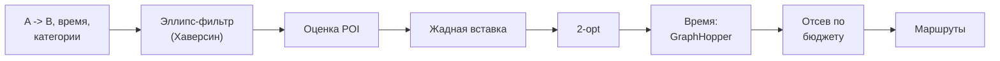
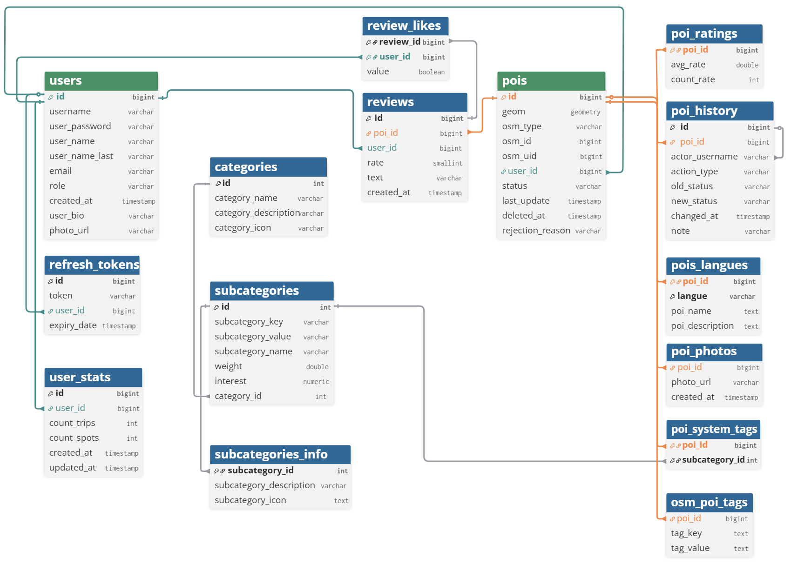

# Walk of Interest - Backend

**Русский** | [English](README.en.md)

REST API для мобильного приложения [Walk of Interest](https://github.com/artemalo/WalkOfInterest): генерация пешеходных маршрутов через интересные места (POI) с учётом категорий интересов, времени и рейтингов.


## Что внутри

- **Алгоритм генерации маршрутов** - собственный: эллипс-фильтр кандидатов, взвешенная оценка POI, жадная вставка + 2-opt, проверка времени через GraphHopper
- **Геоданные** - PostgreSQL + PostGIS: `geometry(4326)`, GiST-индексы, `ST_Within`/`ST_DWithin` в нативных SQL-запросах
- **Парсер OpenStreetMap** - импорт POI из PBF-дампов (osm4j) с батч-вставкой и категоризацией по 60+ подкатегориям с весами
- **Безопасность** - Spring Security + JWT (access + refresh с ротацией), rate limiting на Bucket4j (token bucket)
- **Панель модератора** - Spring MVC + Thymeleaf: проверка пользовательских точек, корректировка координат, история изменений
- **OpenAPI** - документация API через springdoc


## Алгоритм генерации маршрута



**Фильтрация.** Кандидаты - внутри эллипса с фокусами в A и B (`d(T,A) + d(T,B) ≤ 2a`): крюк к любой точке ограничен. Расстояния по Хаверсину (< 0,3 % погрешности до 10 км).

**Оценка.** `score = (0.3·коридор + 0.4·интерес + 0.2·рейтинг) × статус × бонус`:

- *коридор* - гауссова близость к прямой A->B (σ = 300 м);
- *интерес* - вес подкатегории под выбранные пользователем категории;
- *рейтинг* - сигмоида `σ((rate-3)·lg(votes+1))`: одинокая «пятёрка» проигрывает множеству стабильных оценок.

**Сборка.** Каждая точка жадно вставляется туда, где путь удлиняется меньше всего; 2-opt устраняет пересечения (тест: 96 -> 78 мин); реальное пешее время проверяется запросом к GraphHopper; при превышении бюджета точки отсеиваются по убыванию ценности.

Ключевые классы: `GenerateService`, `ScoreCalculatorService`, `OptimizationService`, `RouteAssembler`, `GraphHopperClient`.

## Архитектура

Слоистая архитектура: 9 контроллеров -> 12+ сервисов (связи только через DI-контейнер, прямых вызовов между сервисами нет) -> 9 репозиториев Spring Data JPA. Сквозные функции: JWT-фильтр, `GlobalExceptionHandler` (единый формат ошибок), `RateLimiterService`, клиент GraphHopper на WebFlux.

### Основные эндпоинты

| Группа       | Prefix              | Что делает                                             |
| ------------ | ------------------- | ------------------------------------------------------ |
| Auth         | `/api/auth`         | register, login, refresh (ротация), logout, logout-all |
| Генерация    | `/api/poi/generate` | подбор POI и вариантов маршрута по параметрам          |
| Маршруты     | `/api/poi/route`    | построение пути, время, переупорядочивание точек       |
| POI          | `/api/pois`         | карточки, поиск, отзывы, фото, добавление точек        |
| Категории    | `/api/categories`   | дерево категорий и подкатегорий                        |
| Пользователи | `/api/users`        | профиль, аватар, статистика, отзывы                    |
| Отзывы       | `/api/reviews`      | реакции (лайки/дизлайки)                               |
| Админ        | `/api/admin/pois`   | модерация: статусы, координаты, история                |

### Схема базы данных



`geometry(4326)` для точек/полигонов/мультиполигонов, 2 GiST-индекса, CHECK на типы геометрии, XOR-источник точки (OSM или пользователь), мультиязычные описания POI (`pois_langues`), полная история модерации (`poi_history`).

## Технологии

Java 25 · Spring Boot 4 (Web + WebFlux) · Spring Security + JWT · Spring Data JPA / Hibernate · PostgreSQL + PostGIS · GraphHopper · Bucket4j · osm4j + JTS · Thymeleaf · springdoc-openapi · Lombok · Maven · Docker (multi-stage build -> JRE Alpine)

## Запуск

Backend разворачивается в составе Docker Compose (PostGIS + GraphHopper + backend + Nginx) из [основного репозитория](https://github.com/artemalo/WalkOfInterest) - там же [полный гайд по развертыванию на VDS](https://github.com/artemalo/WalkOfInterest/blob/main/docs/DEPLOYMENT.md).

Конфигурация через переменные окружения:  `DB_URL`, `DB_USERNAME`, `DB_PASSWORD`, `GH_URL`, `JWT_SECRET`, `JWT_EXPIRATION`, `JWT_REFRESH_EXPIRATION`, `APP_BASE_URL`, `UPLOAD_DIR`.

```bash
# standalone build & run
mvn package -DskipTests
java -jar target/woi-*.jar
```